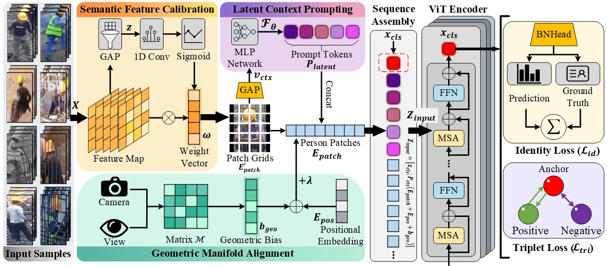

# ISGA-ViT

Official implementation of the paper: **"Robust Person Re-identification in Complex Construction Environments via Implicit Scene-Adaptive Prompting and Geometric Manifold Alignment"**.

 
*(Note: Please put your framework image in `./assets/main_figure.jpg`)*

## News
- **[2026/03]** The source code of ISGA-ViT is released.
- **[2026/03]** The Con-ReID dataset for construction site ReID is released.

## Datasets
Please download the datasets and place them in your data directory.
- **Con-ReID (Ours):** [https://github.com/dongpeng011/ConReID-Dataset]
- [Market-1501](https://www.kaggle.com/datasets/pengcw1/market-1501/data) 
- [MSMT17](http://www.pkuvmc.com/dataset.html) 
- [Occ-Duke](https://github.com/lightas/Occluded-DukeMTMC-Dataset)
- [SYSU-mm01](https://www.isee-ai.cn/project/RGBIRReID.html)
- [Celeb-ReID](https://github.com/Huang-3/Celeb-reID)
- [PRCC](https://www.isee-ai.cn/%7Eyangqize/clothing.html)
-[MLR-CUHK03](https://pan.baidu.com/s/1hMQZq0LAPhIl5RQ_EDDiFg)

Once you download the datasets, please make sure to modify the dataset root paths in the configuration files (e.g., `./configs/con_reid.yml`) manually.

## Environments
We recommend using Linux (Ubuntu 22.04), Python >= 3.8, and PyTorch >= 2.0 (CUDA 12.1). 

Please follow the environment setup from [TransReID](https://github.com/damo-cv/TransReID). You can also install the dependencies using:
```bash
pip install -r requirements.txt